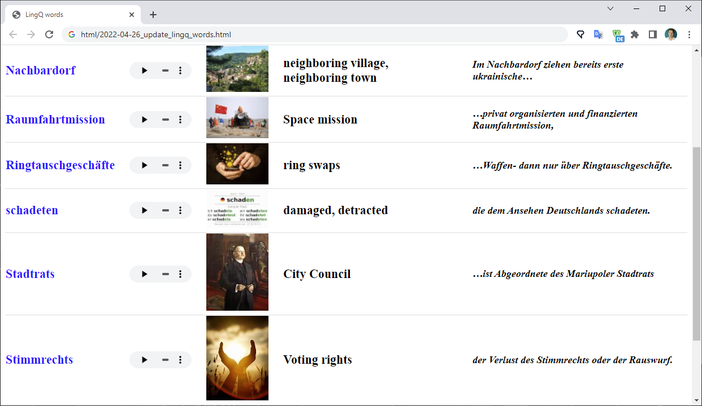

# LingQWordsExport
Will export all your words from **[LingQ](https://lingq.com)** 
to a tab-separated UTF-8 **text** file, **Html**, and **Anki**.

Download the app: [LingQWordsExport.zip](https://github.com/SergeyFM/LingQWordsExport/raw/master/distr/LingQWordsExport.zip)  
Read the [documentation](doc/README.md) page.  
Install and configure the app as described [here](doc/Installation.md).  
Or you can jump right to [my daily routine](doc/MyDailyRoutine.md) page showing all the steps I make getting the words from LingQ to Anki.  

The app connects to the [LingQ API](https://www.lingq.com/apidocs/index.html) and downloads words and sentences. Then it uses Google-translate service to get the sound of the word spoken out loud. And finally, the app fetches images from Google or Bing.  
There are certain peculiarities in how LingQ deals with words and sentences. One such thing is removal of letter's case information - all the words and sentences are saved in lowercase format, and it doesn't go well with German language: 
_– essen (to eat) – das Essen (the food/the eating))_   
To fix this issue the app searches for the word in a given fragment and tries to restore the original word.
   
You will have your words ready for review, and you can easily print them out:
  
And Anki will help learning them:

 
Repository contains following folders: 
 * app - the application ready for run
 * distr - the app folder put in an easy downloadable archive
 * doc - documentation folder
 * src/main/kotlin - source code

  If you want to try the application:

1. Read [documentation](doc/README.md) in the  [documentation folder](https://github.com/SergeyFM/LingQWordsExport/tree/master/doc)

2. Download the app: [LingQWordsExport.zip](https://github.com/SergeyFM/LingQWordsExport/raw/master/distr/LingQWordsExport.zip), unzip it

3. Make sure you have Java 11+ installed ([download page](https://www.oracle.com/java/technologies/downloads/))

4. Edit config.ini - add your key and set the language

5. Run LingQWordsExport_RUN.bat 

6. Review html files with words

7. Import data to Anki

8. Enjoy

Once set up, import takes a few minutes.

I tested the application on a Windows 10 machine. There should be no particular problems running it on other platforms, please let me know how it goes for you.  
You can run several instances of the app to download audio and images faster (I tried 4 in parallel).

I'm open for suggestions and help. Any feedback is appreciated.  
I wish y'all enormous success with language learning!

Sergey Svistunov
