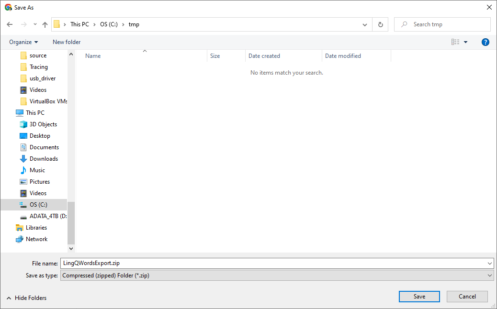
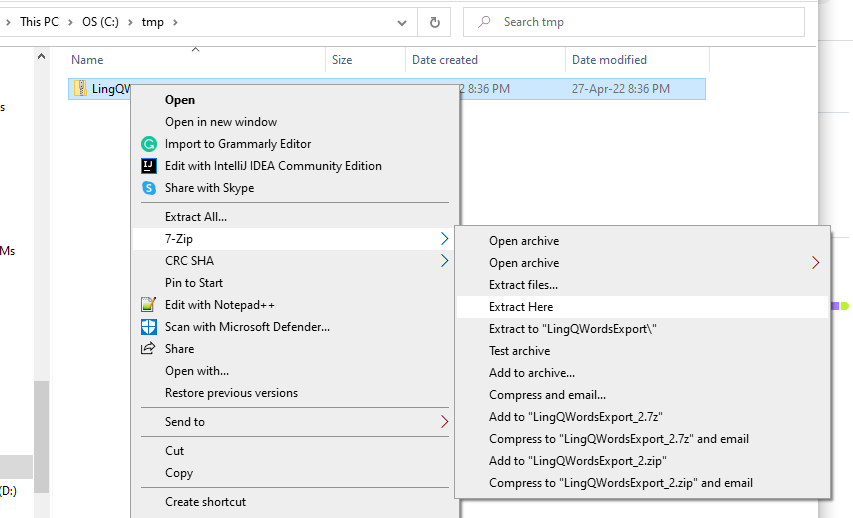
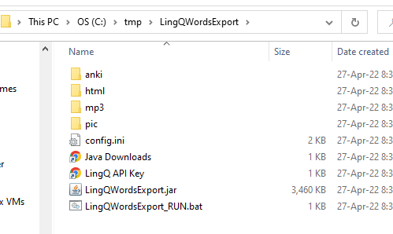
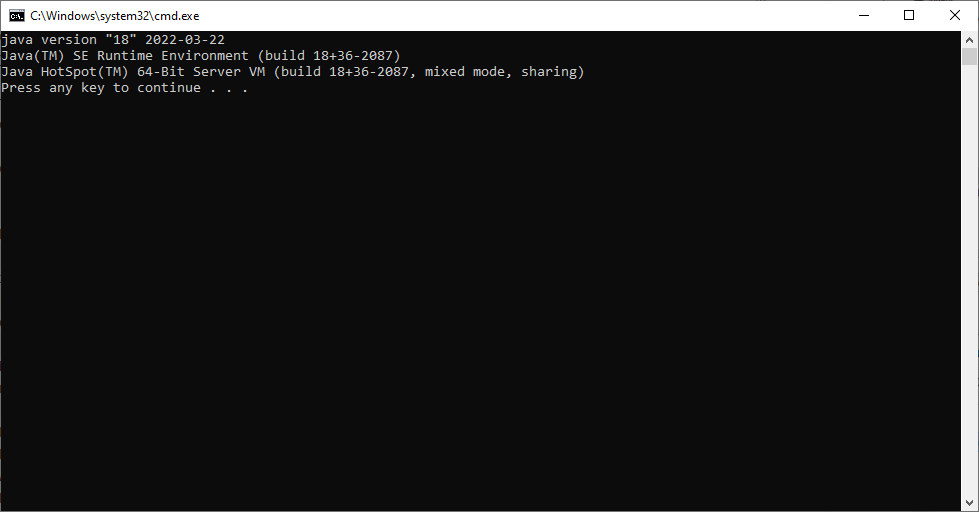
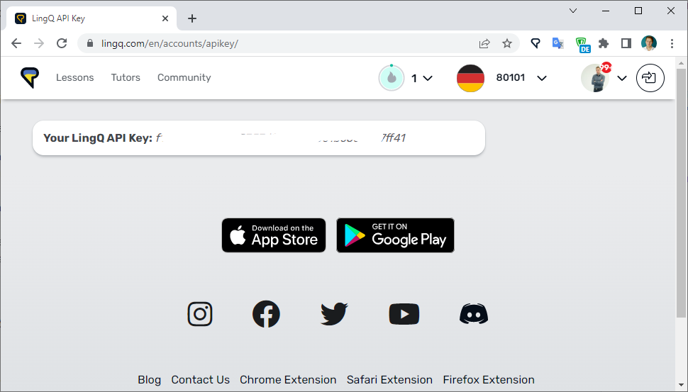
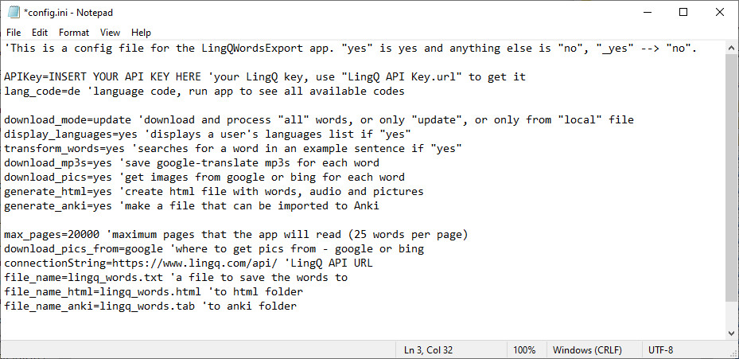

## Installation and configuration.

Here you can find a main [documentation](doc/README.md) page. 
Or jump right to my [my daily routine](MyDailyRoutine.md) with screenshots.  

In this document you'll learn how to install and configure the LingQWordsExport. 
After initial set up, importing will take only a few minutes.

Here's what you have to do:

1. Download the app [LingQWordsExport.zip](https://github.com/SergeyFM/LingQWordsExport/raw/master/distr/LingQWordsExport.zip). 
  
Unzip it. You can use 7Zip, like I do, or any other software. Windows by default can unarchive zip files.  
  
In order for the app to launch correctly you need an application jar file, config.ini, and empty folders: anki, html, mp3 and pic.  

2. Make sure you have Java 11+ installed. You can run `LingQWordsExport_RUN.bat` to see your current version. 
Download it ([download page](https://www.oracle.com/java/technologies/downloads/)) and install if needed.  
On the screenshot you can see that I have Java 18 installed. For now just close the app.  

3. Get your [LingQ API key](https://www.lingq.com/en/accounts/apikey/).

4. Edit the `config.ini` file. As minimum, you should add APIKey and lang_code.

5. Run `LingQWordsExport_RUN.bat` and use it. You can see how I use the app on [my daily routine](MyDailyRoutine.md) page.