## My daily routine.

### I read and mark words on LingQ.
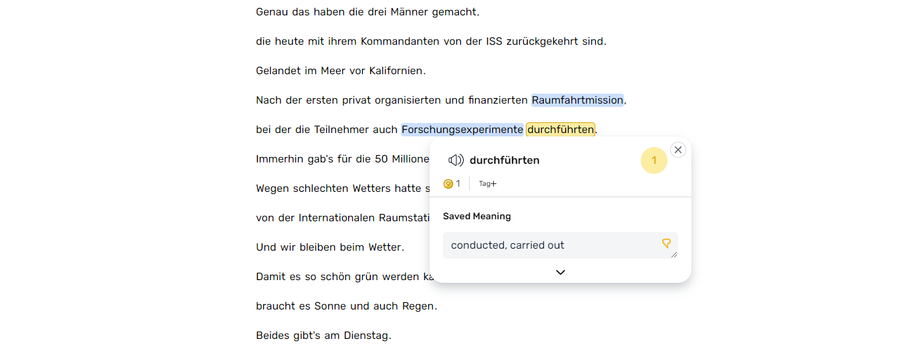

### Run the LingQWordsExport app.
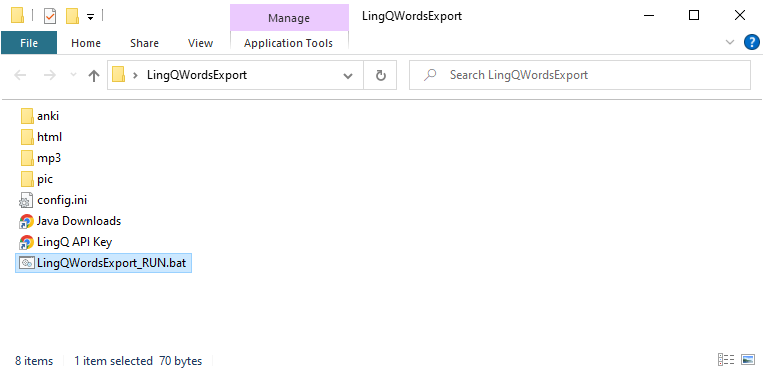

### It gets 10 new definitions from LingQ. Downloads images and sound for each of them.
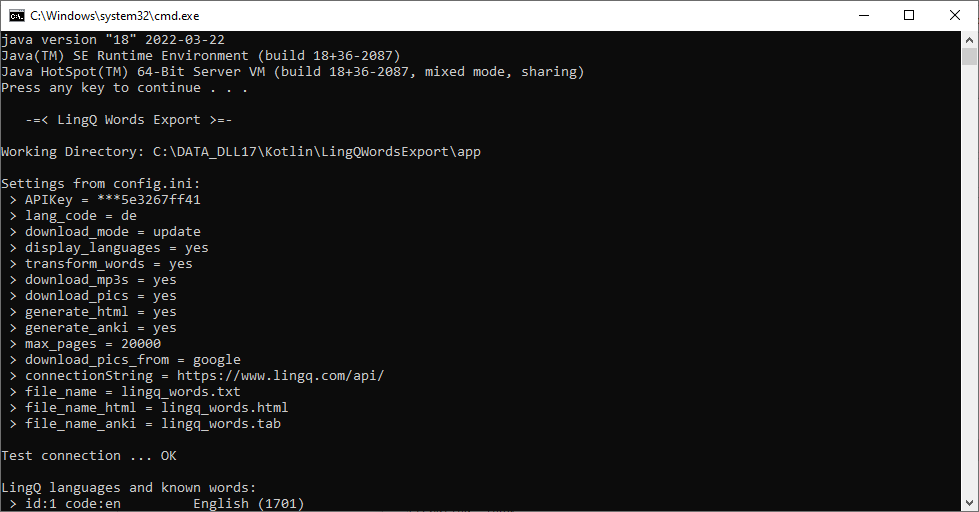
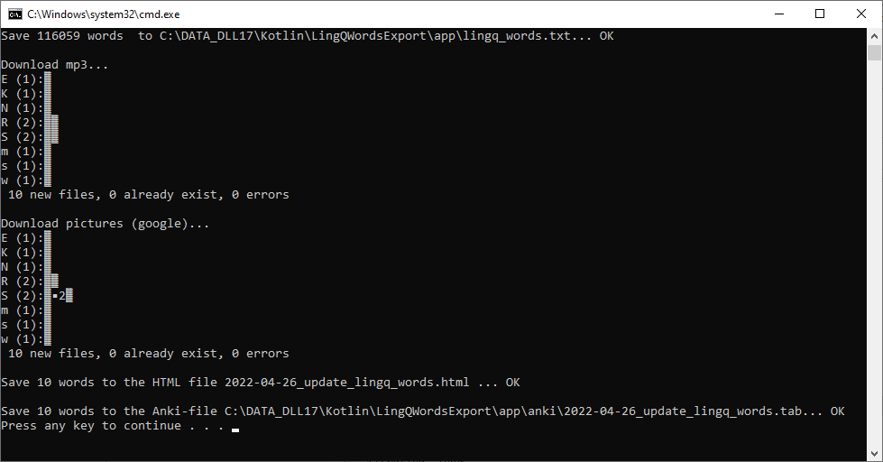

### There is a new html file now. I can see and hear the words I've saved today, the pictures chosen.
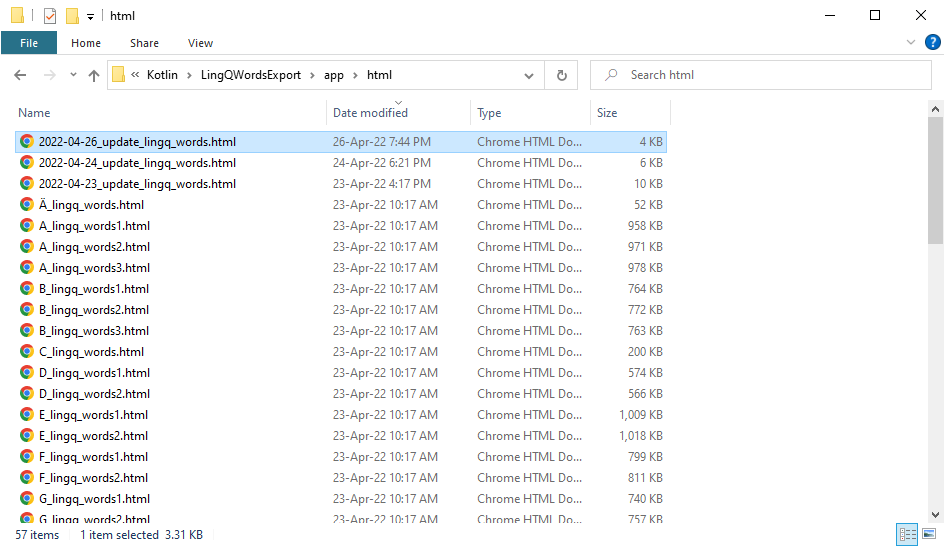
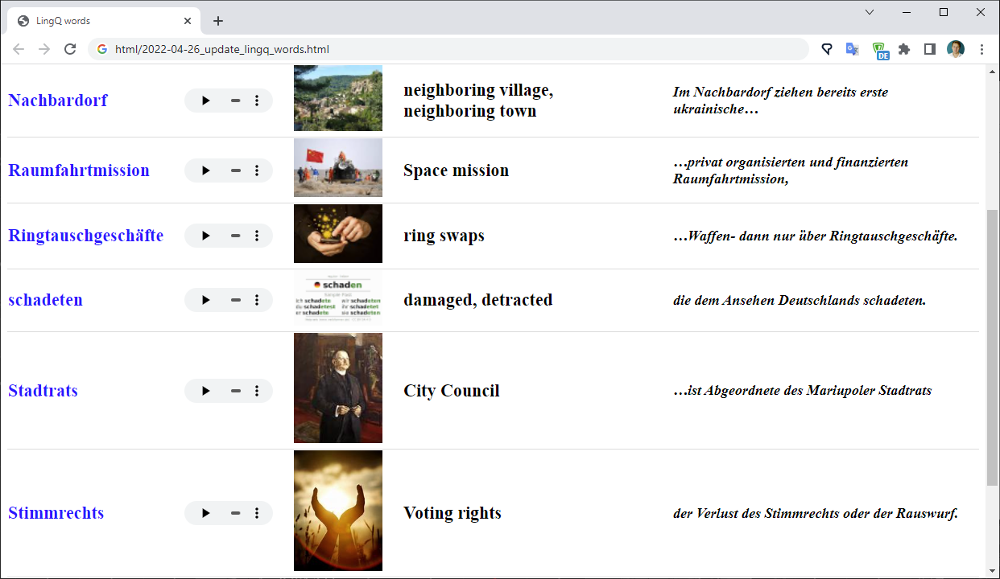

### And finally I import new words to Anki.
Now I copy new media to the Anki media folder.
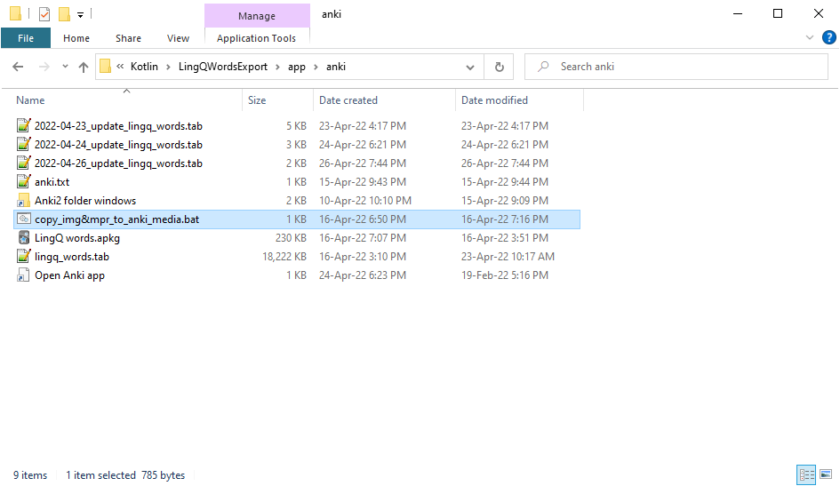
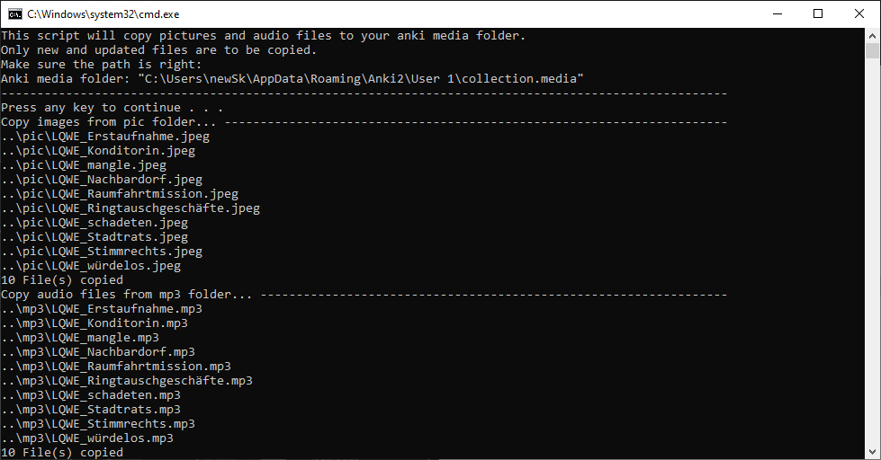

Open Anki.
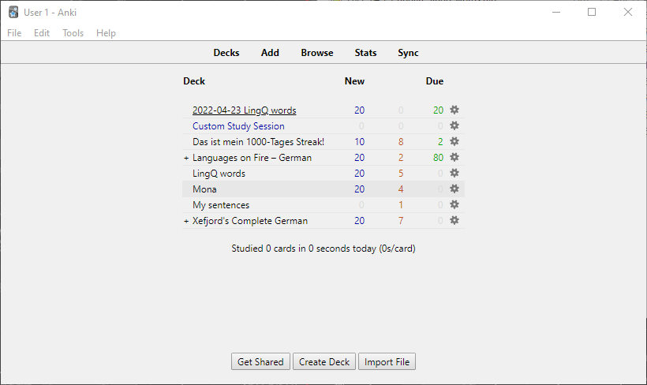
Click import, select what file to import, and in what deck. Allow HTML is checked.
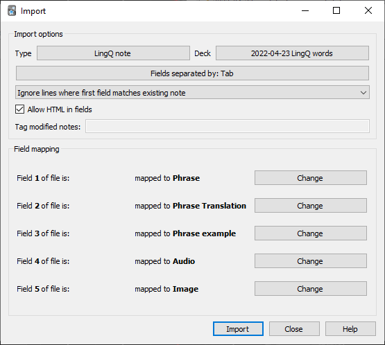
Importing complete!
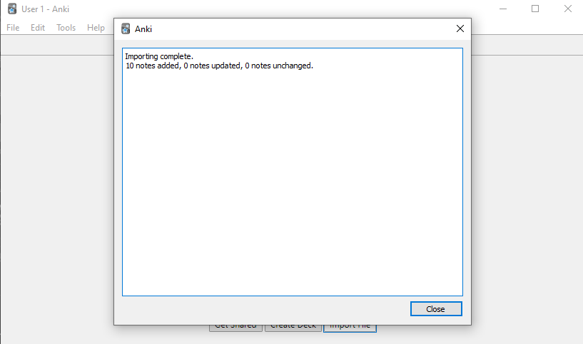

### Everything's ready! Dont' forget to sync data if you want it to be available on all your devices.

Sergey Svistunov.