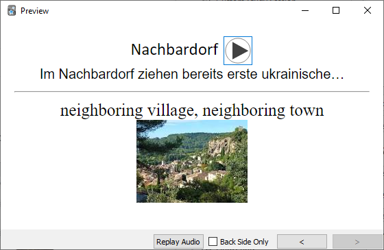

## My daily routine.

Here you can find a main [documentation](README.md) page.  
In this document I show my daily routine: first I read the news and my books in LingQ, then I import and study new words in Anki.
  After initial set up, importing takes only a few minutes.

### I read and mark words on LingQ.

### Then run the LingQWordsExport app.

### Today I got 10 new definitions from LingQ. Download images and sound for each one of them.

### There is a new html file now. 
  
I can see and hear the words I've saved today.
  

### And finally I import new words to Anki.
Copy new media files to the Anki media folder.

Open Anki.  
  
Click import, select what file to import, and in what deck. Allow HTML in fields should be checked.
  
Importing complete!  

### Everything's ready! Don't' forget to sync data if you want it to be available on all your devices.

   
Sergey Svistunov.